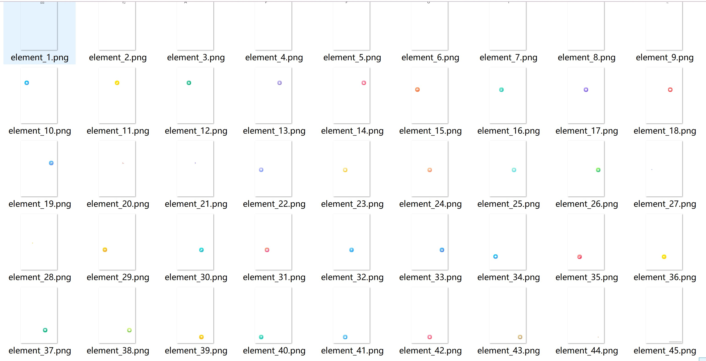
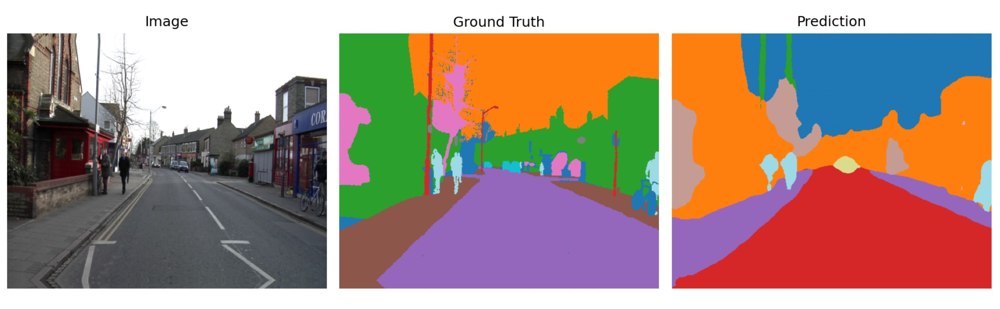
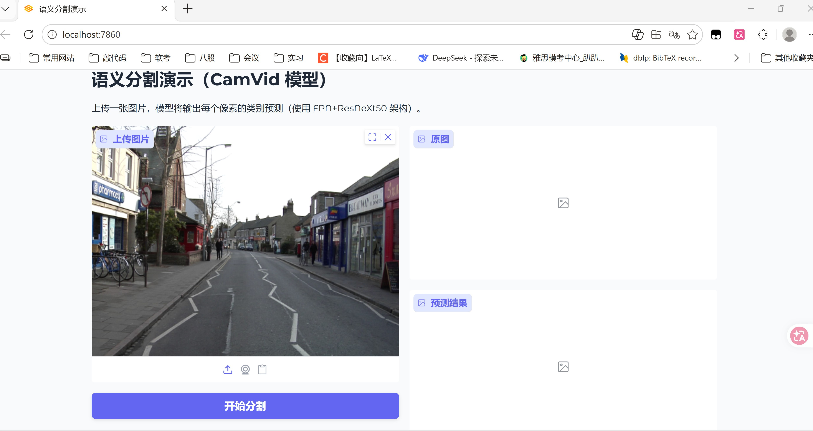
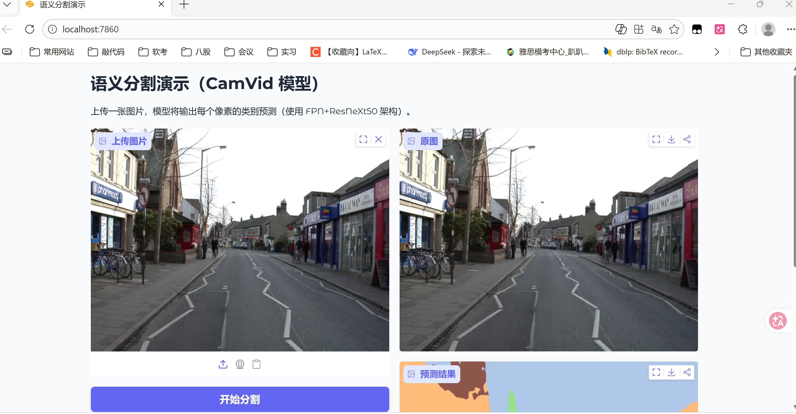
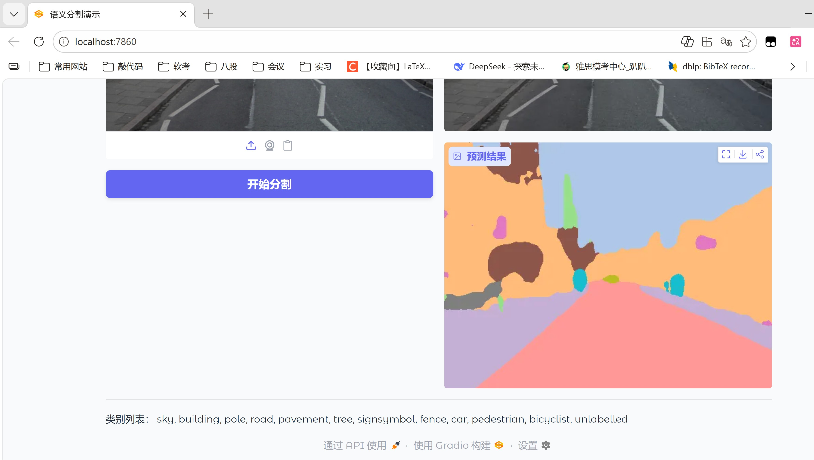

# 方案选择

## 传统算法1（extract1.py）

###### **算法逻辑**：

该算法从PNG图片中分离独立视觉元素。首先读取图片，若存在透明通道，则直接将其二值化作为前景掩码；否则，从图像四角区域采样并计算中值，估计背景主色，通过每个像素与背景色的欧氏距离进行阈值分割得到初步前景掩码，并利用形态学开运算去除噪点。随后对前景掩码执行连通分量分析，过滤面积过小的区域，为每个连通分量生成独立的带透明通道的PNG文件——保留原图RGB值，并将对应分量的透明度设为不透明，其余区域透明。

###### **优缺点**：

优点在于实现简单，仅依赖OpenCV和NumPy，无需深度学习框架；能自适应处理已有透明通道的图片，颜色法基于背景均匀假设在简单背景下效果稳定。缺点是对复杂背景、渐变背景或前景与背景颜色接近的情况分割效果较差，且连通分量分析可能将接触的元素误合并为一个，无法分离重叠或粘连的目标。

###### 效果展示

例图：

分割后：

## 深度学习算法

###### 使用逻辑：

segmentation-models-pytorch，这是一个开源的Python库，它封装了多种主流的分割模型架构（如U-Net、FPN、PSPNet），并提供了大量在ImageNet上预训练好的骨干网络（如ResNet、EfficientNet）。你不需要自己设计网络或从零训练，直接使用预训练权重即可获得不错的效果。

###### **优缺点**：

优点是泛化能力极强，无需依赖背景均匀、元素不粘连等强假设，能有效处理复杂背景、渐变背景、前景与背景颜色接近，以及元素重叠 / 粘连的场景，分割精度远高于传统算法；基于预训练权重的迁移学习模式大幅降低了训练成本，无需从零标注海量数据即可适配特定场景；支持多种主流模型架构，可根据精度 / 速度需求灵活选择。

缺点是依赖 PyTorch 等深度学习框架，环境配置和部署门槛高于传统算法；推理速度较慢，对硬件有一定要求（尤其在无 GPU 的情况下）；虽然有预训练权重，但针对特定场景（如小众 UI 元素、特殊风格贴纸）仍需少量标注数据微调，存在一定的标注和调参成本；模型体积较大，不利于轻量化部署。

###### 效果：

为了更好地演示深度学习模型的效果，这里使用了开源数据集CamVid作为深度学习训练和分割推理的对象。

以下三张图，第一张是原图，第二张是开源数据集中给出的掩码图像，第三张是训练好的模型分割后的效果。

# 可视化效果展示（web_demo.py）——对应深度学习方案

# 元素重叠时的处理方式

对于元素重叠的情况，基于 segmentation-models-pytorch 的深度学习方法会按以下逻辑处理：

- 核心原理：该方法是**像素级语义 / 实例分割**（若选择实例分割架构如 Mask R-CNN，或对 U-Net 输出做后处理），能识别每个像素所属的 “元素实例”，而非仅区分前景 / 背景；
- 具体操作：
  1. 先通过分割模型得到每个重叠元素的独立掩码（Mask），即使元素边缘重叠，模型也能基于纹理、轮廓特征区分不同实例；
  2. 对每个元素的掩码单独裁剪，保留该元素对应的像素区域，将重叠区域中不属于当前元素的像素设为透明；
  3. 若重叠区域的像素特征模糊（如两个元素颜色 / 纹理高度相似），可通过微调模型（加入重叠元素的标注数据）、调整后处理规则（如基于轮廓相似度修正掩码）提升区分度。

相比之下，传统连通组件分析算法会将重叠 / 接触的元素视为同一个连通块，无法分离，而深度学习方法能解决这一核心痛点（效果取决于标注数据的丰富度和模型架构选择，实例分割模型对重叠元素的区分效果优于纯语义分割）。

# 方法失效的图片场景

#### （1）深度学习方法的失效场景

- 极端低质量图片：图片分辨率极低（如小于 64×64）、严重模糊 / 压缩失真，导致像素特征丢失，模型无法识别元素轮廓；
- 无标注匹配的小众场景：如元素为特殊手绘风格、透明渐变叠加过多，且无对应的标注数据微调，预训练模型无法识别这类 “非通用特征” 的元素；
- 硬件 / 环境限制下的极端情况：无 GPU 加速且图片尺寸极大（如 4K 分辨率），推理时间过长甚至内存溢出，导致分割流程中断；
- 元素与背景完全融合：如元素颜色、纹理与背景完全一致（如透明渐变元素叠加在同色系渐变背景上），且无任何边缘 / 轮廓特征，模型无法区分像素归属。

#### （2）若选用传统算法的失效场景

- 元素有重叠 / 接触：连通组件分析会将其合并为一个块，无法分离；
- 背景复杂：如背景有渐变、纹理、噪点，或背景色与前景色欧氏距离小于阈值，生成的前景掩码会包含大量背景噪声，或丢失部分前景；
- 无透明通道且前景无明显边界：如渐变透明的元素，Alpha 通道生成时会因阈值设置问题，导致元素边缘被误判为背景。

# 关于更多进阶题的思考

由于时间有限，不到一天的时间不能完成进阶内容，因此我在这里只提我想到的解决思路。

## 1.背景修复的思路

- 基础方法：基于OpenCV的传统修复算法（轻量、无训练成本）。用于背景纹理简单（如纯色、渐变、低纹理）的图片，无需深度学习，快速落地；但若背景含复杂纹理（如风景、花纹、多色拼接），传统`inpaint`效果差。利用OpenCV的`inpaint`函数，基于空洞周围的像素纹理和颜色信息，通过“纹理合成”填充空洞。该函数支持两种模式：
  - `INPAINT_NS`：基于Navier-Stokes方程，适合平滑背景（如纯色、渐变）；
  - `INPAINT_TELEA`：基于快速行进法，适合有轻微纹理的背景（如浅纹理画布）。
- 深度学习方法：LaMa（Large Mask Inpainting）是开源修复模型，能处理大尺寸空洞、复杂纹理背景，核心优势是利用上下文语义补全纹理，修复后无明显拼接痕迹。对于背景含复杂纹理（如木纹、风景、文字）、空洞面积大（超过图片10%）的情况，修复效果远优于传统算法。局限性：需要含有GPU（CUDA），CPU推理速度极慢；模型体积较大（约几百MB），部署门槛高于OpenCV方法。
- 分析：如果背景是复杂纹理（⽂字、⽹格、规则图案），优先使用深度学习方法。如果分离的是"图⽚中央的⼈物"，背景要补全背后的建筑，这个必须使用深度学习方法，非深度学习算法几乎不可能处理这样的背景修复。如果要求实时处理（30fps），则优先选择 OpenCV 传统修复算法 —— 其推理速度极快，无硬件门槛，能满足实时性要求，但需接受其在复杂背景下的修复效果不足；若需兼顾深度学习方法的修复效果与实时性，可通过模型轻量化手段加速：如对 LaMa 模型进行量化（INT8 量化）、剪枝（移除冗余网络层）、蒸馏（用小模型学习大模型特征），或采用 ONNX/TensorRT 进行推理加速，也可缩小输入图片分辨率后再修复，这些方式能一定程度提升推理速度，但会牺牲部分修复精度。

## 2.分离质量评价指标

| 指标名称          | 全程                    | 计算方式                                                  | 取值范围 | 评价标准    |
| :---------------- | :---------------------- | :-------------------------------------------------------- | :------- | :---------- |
| 像素准确率（PA）  | Pixel Accuracy          | 正确分离的元素像素数 / 实际元素总像素数                   | [0,1]    | 越接近1越好 |
| 交并比（IoU）     | Intersection over Union | 分离出的元素掩码与真实元素掩码的交集面积 / 并集面积       | [0,1]    | 越接近1越好 |
| 粘连误检率（FPI） | False Positive Instance | 被误合并的粘连/重叠元素实例数 / 实际粘连/重叠元素总实例数 | [0,1]    | 越接近0越好 |

使用该组指标需以人工标注为基准 —— 需对测试集中的图片完成元素掩码、粘连 / 重叠元素实例的人工标注，再将机器分割结果与人工标注结果逐维度比对，才能计算出 PA、IoU、FPI 的具体数值。

在完全脱离人类参与、无监督的场景下，机器无法自主判定 “哪些像素 / 实例属于正确分离的元素”，因此难以对分离质量做出客观评价。

## 3.修复质量评价指标

| 指标名称               | 原名称/行业标准             | 计算方式                                              | 取值范围 | 评价标准    |
| :--------------------- | :-------------------------- | :---------------------------------------------------- | :------- | :---------- |
| 结构相似性指数（SSIM） | Structural Similarity Index | 修复区域与周边背景区域的SSIM值（衡量纹理/结构一致性） | [0,1]    | 越接近1越好 |
| 均方误差（MSE）        | Mean Squared Error          | 修复区域像素与空洞周围可靠背景区域的RGB值均方误差     | [0,+∞)   | 越接近0越好 |
| 空洞填充完整度（FC）   | Fill Completeness           | 被有效填充的空洞像素数 / 总空洞像素数                 | [0,1]    | 越接近1越好 |

SSIM：仅能衡量修复区域与周边背景的纹理、亮度、对比度一致性，无法评价修复内容的语义合理性（如人物移除后补全的建筑结构是否符合现实逻辑），需结合主观评价补充；计算时建议选取修复区域外扩 5-10 像素的背景区域作为参考，避免仅对比空洞边缘导致结果失真。

MSE：MSE 越小，说明修复区域与背景颜色越一致；数值偏大仅代表色差明显，不代表修复错误。

FC：是唯一无需真值、可无监督计算的指标，仅需基于空洞掩码统计填充状态，但仅能反映 “是否填充”，无法衡量 “填充效果好坏”，需与 SSIM/MSE 配合使用。

## 4.如何进一步改进效果

为了在**复杂背景、元素重叠、粘连**等场景下进一步提升分离精度与鲁棒性，可以引入**基于大模型的分割方案**，例如 Meta 提出的 **SAM（Segment Anything Model）**。

- SAM 是一种**通用、零样本 / 小样本图像分割大模型**，具备极强的目标感知与轮廓识别能力，能在无需针对本任务重新训练的情况下，直接对图像中的各类视觉元素进行高精度分割。
- 相比传统连通组件分析和普通语义分割，SAM 可以：
  1. 更准确地识别**视觉上独立但像素接近 / 接触**的元素，大幅降低粘连误判率；
  2. 对**复杂背景、无明显颜色差异**的图像依然能稳定分割前景元素；
  3. 支持点、框、掩码等多种交互方式，可灵活适配 “自动批量分离” 与 “精修单个元素” 两种模式。